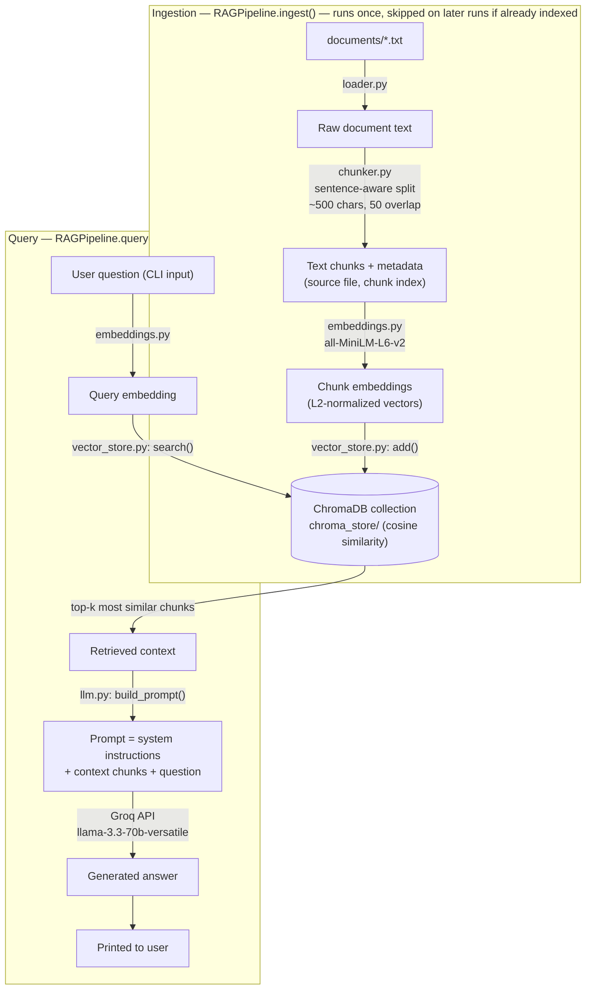

# RAG Pipeline (no LangChain / LlamaIndex)

A Retrieval-Augmented Generation pipeline built from scratch — no orchestration framework.
Embeddings run locally via HuggingFace `sentence-transformers`, vectors are stored in
ChromaDB, and answers are generated with Groq.

## How it works

1. **Load** — `loader.py` reads every `.txt` file in `documents/`.
2. **Chunk** — `chunker.py` splits each document into ~500-character chunks on
   sentence boundaries, with a 50-character overlap so context isn't lost at the edges.
3. **Embed** — `embeddings.py` encodes chunks with the HuggingFace model
   `sentence-transformers/all-MiniLM-L6-v2` (runs locally, no API cost).
4. **Store** — `vector_store.py` persists embeddings in a local ChromaDB collection
   (`chroma_store/`), using cosine similarity.
5. **Retrieve** — a user question is embedded the same way and matched against the
   collection to pull back the top-k most relevant chunks.
6. **Generate** — `llm.py` builds a prompt from the retrieved chunks and calls Groq
   (`llama-3.3-70b-versatile`) to produce a grounded answer.

`rag_pipeline.py` (`RAGPipeline` class) wires these stages together; `main.py` is the CLI entrypoint.

## Architecture

There are two distinct flows: **ingestion** (runs once, builds the index) and **query**
(runs per question, reuses the index).



**Why two flows:** embedding and indexing documents is comparatively expensive, so it's
done once and persisted to disk (`chroma_store/`). Every question after that only pays
the cost of one embedding call + one similarity search + one Groq call — no
re-processing of the document set.

**Why grounding matters:** the LLM never sees the raw documents — only the top-k chunks
retrieved for that specific question. `llm.py`'s system prompt instructs it to answer
*only* from that context and say so if the answer isn't there, which is what keeps
answers grounded instead of hallucinated.

## Project structure

```
rag_pipeline/
├── documents/          # source .txt files to ingest
├── chroma_store/        # persisted vector DB (created on first run, gitignored)
├── loader.py            # reads .txt files
├── chunker.py            # sentence-aware text chunking
├── embeddings.py        # HuggingFace embedding model wrapper
├── vector_store.py      # ChromaDB-backed vector store
├── llm.py                # prompt building + Groq generation
├── rag_pipeline.py      # RAGPipeline: ingest() + query()
├── main.py               # CLI entrypoint
├── requirements.txt
└── .env                  # GROQ_API_KEY, HF_TOKEN (gitignored)
```

## Setup

Create virtual env and install the dependencies in that environment
```powershell
cd RAG\rag_pipeline
uv init
uv venv
source .venv/Scripts/activate
pip install -r requirements.txt
```

Add your keys to `.env`:

```
GROQ_API_KEY=your_groq_api_key
HF_TOKEN=your_huggingface_token
```

- Get a Groq key at https://console.groq.com/keys
- Get a HuggingFace token at https://huggingface.co/settings/tokens
  (optional — only avoids an anonymous rate-limit warning on model download)

## Run

```terminal
python main.py
```

On first run, this embeds and indexes everything in `documents/` into `chroma_store/`,
then drops you into a question loop:

```
You: What is RAG?
Assistant: ...

You: exit
```

Subsequent runs reuse the persisted index automatically and skip re-embedding. To force
a full re-index (e.g. after changing `documents/`), pass `--force`:

```powershell
python main.py --force
```

This resets the ChromaDB collection and re-embeds everything in `documents/` from scratch.

## Adding your own documents

Drop `.txt` files into `documents/`, then run `python main.py --force` to re-index
(or delete the `chroma_store/` folder and run `python main.py` normally).
